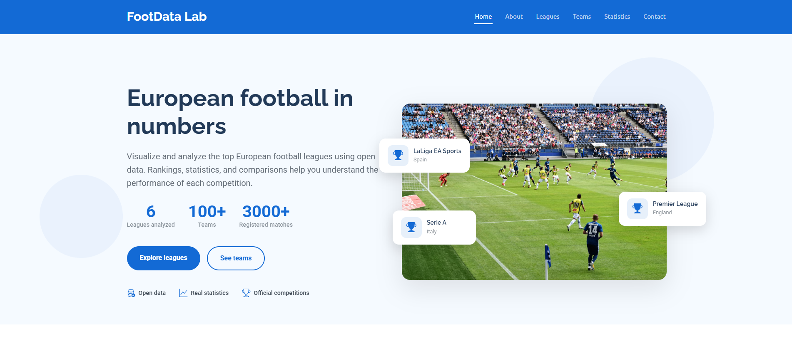
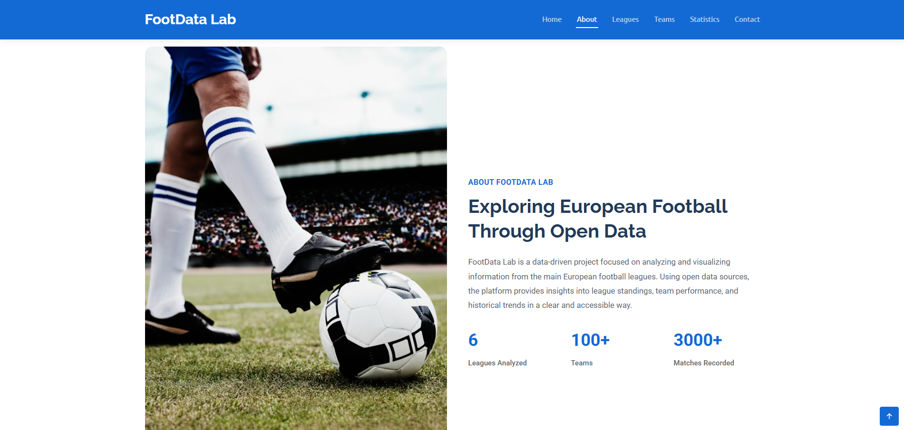
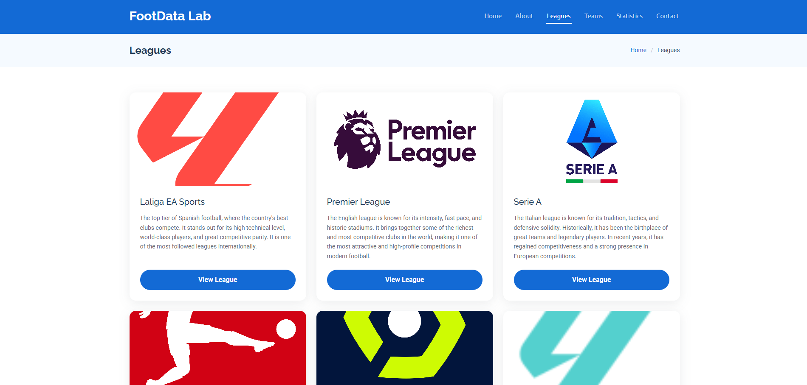
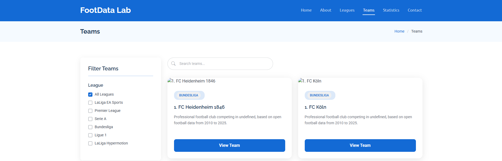
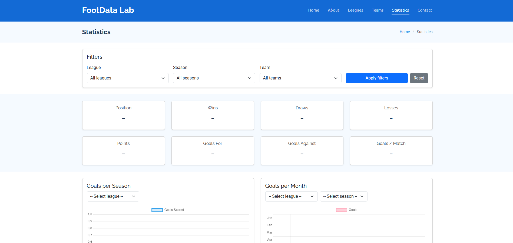
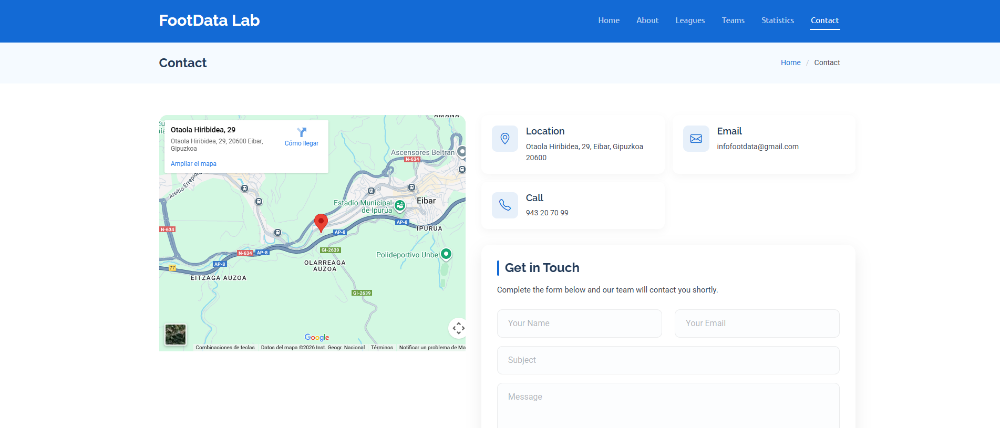

# ⚽ FootData-Lab

## 📑 Aurkibidea
- [Deskribapena](#deskribapena)  
- [Screenshotak](#screenshotak)  
- [Aplikazioaren egitura](#aplikazioaren-egitura)  
- [Erabilitako teknologiak](#erabilitako-teknologiak)  
- [Proiektuaren egitura](#proiektuaren-egitura)  
- [Bugak eta murrizketak](#bugak-eta-murrizketak)  
- [Datuen iturria](#datuen-iturria)  
- [Instalazioa](#instalazioa)

---

## 📋 Deskribapena
**FootData-Lab** futbolarekin lotutako datuen analisi-proiektu bat da. Proiektu honek **open data** erabiltzen du, kasu honetan GitHub-eko biltegi publiko batetik ateratako datuak, eta futbol-estatistika desberdinak modu bisualean erakusten ditu.

Helburua futbol-datuak aztertzea eta aurkeztea da, web teknologiak erabiliz, informazioa modu argi eta ulergarrian bistaratuz.

---

## 🖼️ Screenshotak 
Aplikazioaren erabilera hobeto ulertzeko, hemen ikus daitezke screenshot batzuk:








---

## 🗺️ Aplikazioaren egitura
Aplikazioak atal nagusi hauek ditu:

- **Home**: Hasierako pantaila, azken datuak eta laburpena erakusten ditu.  
- **About**: Proiektuaren helburuak eta informazio orokorra.  
- **Leagues**: Ligak eta denboraldiak aukeratzeko atala.  
- **Teams**: Liga bakoitzeko taldeak erakusten ditu.  
- **Statistics**: Grafiko eta taulen bidez estatistika desberdinak erakusten ditu.  
- **Contact**: Harremanetarako informazioa eta formularioa.

---

## 🚀 Erabilitako teknologiak
- HTML5
- CSS3
- Bootstrap
- JavaScript

---

## 📂 Proiektuaren egitura
```text
FootData-Lab/
├── index.html
├── about.html
├── leagues.html
├── teams.html
├── statistics.html
├── contact.html
└── assets/
    ├── css/         # Estiloak
    ├── js/          # Scripts JavaScript
    ├── img/         # Argazkiak eta screenshotak
    └── vendor/      # Liburutegiak (Bootstrap, Swiper, AOS, etc.)

```
---

## 🐞 Bugak eta murrizketak
Une honetan **ez da bug larririk detektatu**, baina **batzuetan grafikoren bat moztu egiten da** pantaila txikietan edo datu kopuru handiekin.

---

## 📚 Datuen iturria
Proiektu honetan erabilitako datuak **open data** dira, GitHub-eko biltegi publiko batetik eskuratuak.

Datuen jatorria: 
```text
https://github.com/openfootball/football.json
```

Datuen egileei dagokien kreditu guztia aitortzen zaie.

---

## ⚙️ Instalazioa
1. Biltegia klonatu:
   ```bash
   git clone https://github.com/asiercarabantes-uni/FootData-Lab.git
   cd FootData-Lab
   ```

2. Ireki index.html fitxategia nabigatzailean.
